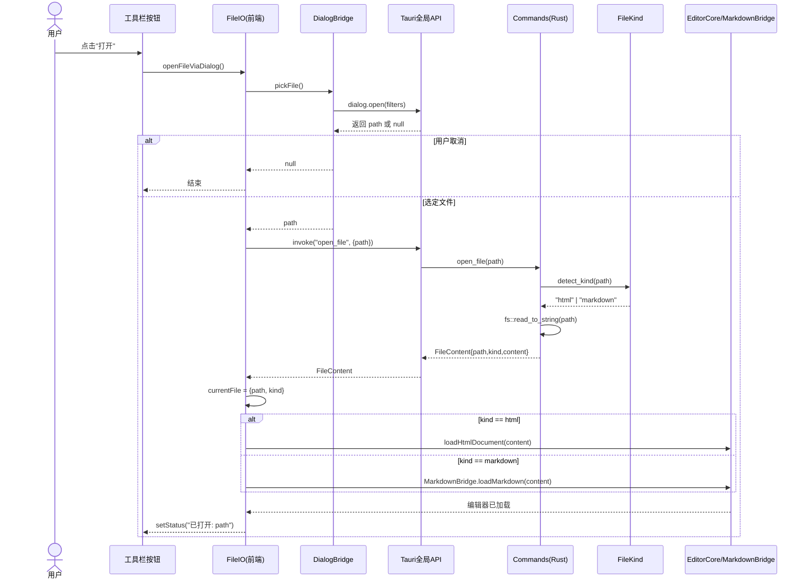
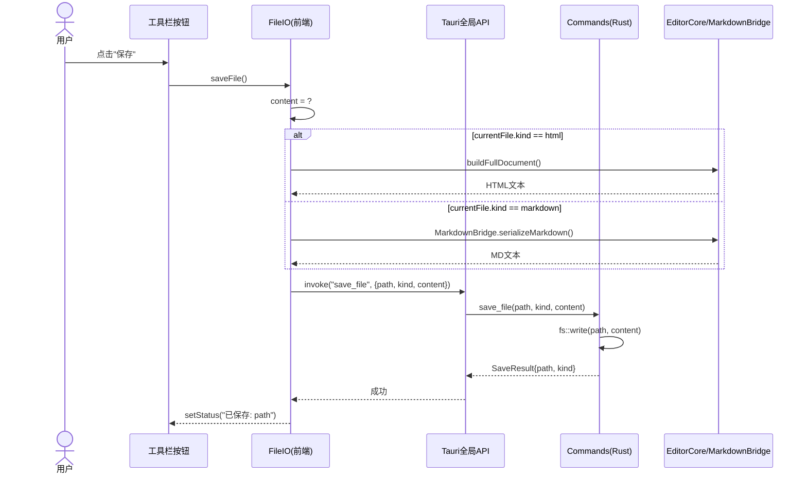
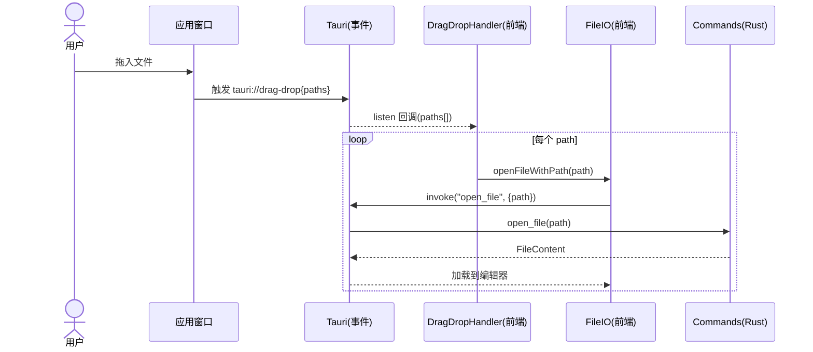
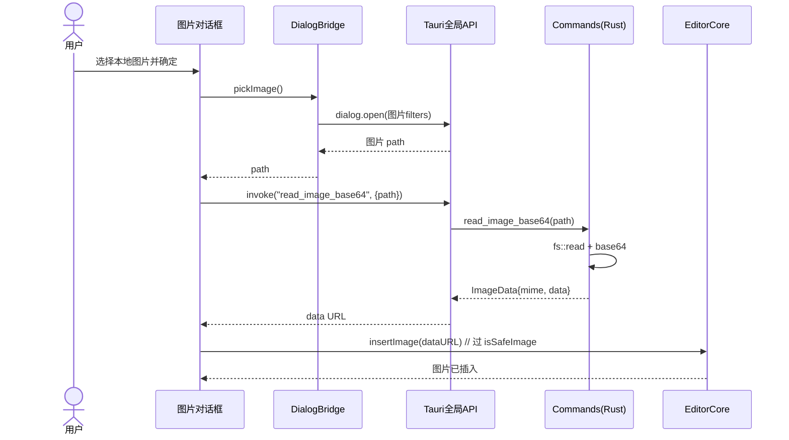
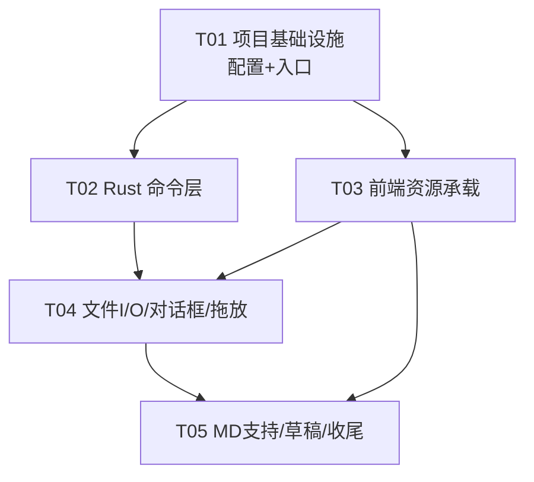

# Tauri 2 富文本 / Markdown 编辑器 —— 架构设计方案

> 作者：高见远（架构师 / software-architect）
> 基于现有单文件 `index.html`（零依赖、纯 HTML/CSS/JS）迁移至 **Tauri 2（Rust + 系统 WebView）**
> 本文仅做设计，不编写完整实现代码，不修改现有 `index.html`。

---

## 1. 现状分析与迁移目标

### 1.1 现有前端已具备的能力（直接可复用）

通读 `index.html`（1266 行）后，确认以下模块**逻辑完整、可直接复用**，无需重写：

| 模块 | 位置 | 说明 |
|------|------|------|
| 编辑区 `contenteditable` | `.editor` (#389) | 所见即所得编辑核心 |
| 工具栏 UI + 事件分发 | `.toolbar` (#306) + 监听器 (#1138) | 加粗/斜体/下划线/标题 H1–H6/列表/引用/链接/图片/表格/代码块/hr/撤销/重做/打开/保存/导出/清空 |
| 历史栈 | `history` / `commitHistory` / `undo` / `redo` (#442–652) | 快照机制、输入合并、大快照降级、撤销重做，设计成熟 |
| 选区 / 光标工具 | `getCaretOffset` / `setCaretOffset` / `saveSelection` (#524–578) | 基于字符偏移，兼容 innerHTML 恢复 |
| 安全校验 | `isSafeLink` / `isSafeImage` (#489–508) | scheme 白名单，防 XSS，必须保留 |
| HTML 加载 | `loadHtmlDocument` / `stripOnAttributes` / `injectFileStyle` (#1019–1066) | 剥离 `<script>`/`on*`，注入源样式、保留标题 |
| 文档拼装 | `buildFullDocument` (#1069) | 源 head + 编辑内容拼完整文档 |
| 导出 HTML | `exportHTML` (#937) | 自包含 HTML 导出 |
| 占位提示 / 工具栏高亮 | `updatePlaceholder` / `updateToolbarState` (#658–766) | |
| 格式化命令封装 | `runCommand` / `formatCommand` / `toggleBlock` / `insertHTML` (#680–739) | 基于 `execCommand` |
| 链接/图片对话框 | `#link-dialog` / `#image-dialog` (#400–425, #786–883) | |
| 粘贴纯文本 | `paste` 监听 (#1226) | 降 XSS 风险 |
| 自动保存 | `scheduleAutosave` (#994) | debounce 500ms 写 `localStorage` |

### 1.2 必须改造的部分

| 改造项 | 现状 | 目标 |
|--------|------|------|
| 文件打开 | `window.showOpenFilePicker` + 降级 `<input type=file>` (#1093) | Tauri `plugin-dialog` + `invoke('open_file')` |
| 文件保存 | `createWritable` / 降级下载 (#1116) | `invoke('save_file', {path, kind, content})` 直接写回 |
| 拖放 | 无可靠实现（仅降级 input，#1167） | Tauri `dragDropEnabled` + `tauri://drag-drop` 事件 |
| 图片插入 | `<input type=file>` 读 FileReader 转 base64 (#854) | Tauri webview 下 `<input type=file>` 不可靠 → `plugin-dialog` 选图 + Rust 读 base64 |
| 文件状态 | `currentFileHandle`（FS Access 句柄）(#456) | `currentFile = { path, kind }` 普通对象 |
| 草稿策略 | 启动恢复 `localStorage` 草稿 (#1244) | 打开本地文件后以文件内容为准，草稿逻辑需调整 |
| 新增 | — | Markdown 加载/保存分支（现有代码**未真正实现** MD 解析/序列化，仅 PRD 提及思路） |

### 1.3 迁移目标

1. **原生文件读写**：跨平台一致地覆盖写回任意本地文件（不再受 FS Access API 的 Chromium-only 限制）。
2. **可靠拖放**：原生拖入文件即加载。
3. **原生对话框**：打开/保存/另存为使用系统对话框。
4. **最小迁移成本**：保留纯原生前端（用户倾向），不引入构建步骤。

---

## 2. 项目结构（文件列表与相对路径）

采用**增量迁移**：在现有项目根目录 `D:\Share\Scripts\Explore\htmlEditor\` 内新增 `src-tauri/`，并把现有 UI 整理为 `src/`（拆分内联的 `<style>` 与 `<script>`）。原根目录 `index.html` 可保留作参考或删除。

```
D:\Share\Scripts\Explore\htmlEditor\
│
├── package.json                     # 前端依赖 + tauri 脚本（仅 CLI 必需）
├── .gitignore                       # 忽略 /src-tauri/target、node_modules
├── src\                             # 前端资源目录（承载现有 UI，由 Tauri 直接加载）
│   ├── index.html                   # 现有 UI 迁移版（改造文件 I/O / 拖放 / 对话框）
│   ├── styles.css                   # 从现有 <style> 提取（含编辑器排版样式）
│   ├── app.js                       # 从现有 <script> 提取并改造（invoke 接入）
│   └── vendor\                      # 可选：离线自包含的第三方库（零 CDN 依赖）
│       ├── marked.min.js            # MD→HTML（若放前端）
│       └── turndown.min.js          # HTML→MD（若放前端）
│
└── src-tauri\                       # Rust 侧（Tauri 2 标准结构）
    ├── Cargo.toml                   # Rust 依赖与包配置
    ├── build.rs                     # tauri-build 构建脚本
    ├── tauri.conf.json              # Tauri 配置（窗口/构建/安全/插件）
    ├── capabilities\                # Tauri 2 权限模型
    │   └── default.json             # 默认 capability（dialog / event / window 权限）
    ├── icons\                       # 应用图标（cargo tauri icon 生成）
    │   ├── icon.png
    │   ├── icon.ico
    │   └── ...（其他平台图标）
    └── src\
        ├── main.rs                  # 程序入口，调用 lib::run()
        ├── lib.rs                   # Tauri Builder 装配（插件 + invoke_handler）
        ├── commands.rs              # 核心 Rust 命令（open_file / save_file 等）
        ├── file_kind.rs             # 扩展名 → 文件类型路由
        └── markdown.rs              # 可选：Rust 侧 MD 解析/序列化（pulldown-cmark）
```

> 说明：Tauri 2 中 `frontendDist` 指向 `../src`，`tauri.conf.json` 的 `build.frontendDist` 即加载 `src/index.html`。Rust 侧编译产物在 `src-tauri/target/`，由 `tauri-build` 把前端打包进二进制。

---

## 3. 前端技术栈选型论证：保留原生 vs 引入 Vite

### 3.1 结论

**推荐保留纯原生 HTML/CSS/JS，不引入 Vite。**

### 3.2 论证

| 维度 | 保留原生（推荐） | 引入 Vite |
|------|----------------|-----------|
| 迁移成本 | 极低：仅拆分 `<style>`→`styles.css`、`<script>`→`app.js`，逻辑几乎不动 | 中：需把 IIFE 改造为 ESM 模块、配置 `vite.config`、调整 `index.html` 引入方式 |
| 构建步骤 | 无，`cargo tauri dev/build` 直接打包静态文件 | 有，`beforeDevCommand`/`beforeBuildCommand` 需跑 `vite` |
| 模块解析 | 通过 `window.__TAURI__` 全局对象调用 API（Tauri 2 支持 `withGlobalTauri`） | 通过 `import { invoke } from '@tauri-apps/api/tauri'`（需打包） |
| 类型安全 | 无 TS（现有代码即 JS） | 可上 TS |
| 开发体验 | 改完即 reload，无 HMR | HMR 好 |
| 离线/自包含 | 完全离线 | 需 `npm install` |

### 3.3 关键机制：`withGlobalTauri`

Tauri 2 默认不再暴露全局 API。在 `tauri.conf.json` 的 `app.withGlobalTauri: true` 后，前端可直接用普通 `<script>`（非 module）访问：

```js
// 无需打包，无需 import
const { invoke } = window.__TAURI__.tauri;
const { open, save } = window.__TAURI__.dialog;
const { listen } = window.__TAURI__.event;
```

这正好契合现有 IIFE 写法——现有 `app.js` 无需改成 ESM，只需把 `openFile()`/`saveFile()` 内部换成 `window.__TAURI__.tauri.invoke(...)` 调用即可。

### 3.4 注意事项（保留原生的代价与对策）

1. **`<input type=file>` 不可靠**：Tauri 的 webview 对原生 file input 支持有限，图片插入必须改用 `plugin-dialog` 选文件 + Rust 读 base64。
2. **Markdown 库引入方式**：若 MD 解析/序列化放前端，`marked`/`turndown` 建议**下载到 `src/vendor/` 本地引用**（离线自包含），而非 CDN（避免运行时依赖网络、且 CSP 限制）。
3. **CSP**：`tauri.conf.json` 的 `app.security.csp` 建议设为 `null`（开发期宽松）；若收紧，需放行 `vendor/` 下的 `script-src 'self'` 与图片 `data:`（内嵌 base64 图片）。
4. **无模块作用域**：全局变量需注意命名，现有 IIFE 已自包含，问题不大。

### 3.5 何时再升级到 Vite

若后续需要 TypeScript、组件化、HMR，可平滑升级：把 `app.js` 改为 ESM + TS，`frontendDist` 指向 `dist`，`beforeDevCommand: "vite"`。本方案设计的 Rust 命令边界与通信协议**不依赖前端构建方式**，升级无破坏。

---

## 4. Rust 命令边界（核心）

### 4.1 设计原则

- **Rust 只管文件与系统交互**，不触碰 Markdown 业务逻辑（Markdown 转换放前端，`marked`/`turndown` 成熟稳定；Rust 侧 `html2md` 不成熟，避免引入局限）。
- **单一职责**：`open_file` 读文件、按扩展名路由类型、返回原始文本；`save_file` 接收已序列化好的最终文本、原样写盘。Rust 对 content 不关心是 HTML 还是 MD。
- **对话框交给前端**：用 `@tauri-apps/plugin-dialog` 的 `open()`/`save()` 选路径，再把路径传给命令（职责清晰，且用户取消处理简单）。

### 4.2 文件类型路由

`file_kind.rs` 根据扩展名判断：

| 扩展名 | kind | content 含义 | 前端处理 |
|--------|------|-------------|----------|
| `.html`, `.htm` | `html` | 文件原文 | `loadHtmlDocument(content)` |
| `.md`, `.markdown` | `markdown` | 文件原文（MD 源文） | `marked.parse(content)` → 注入编辑器 |
| 其他 | — | 返回错误 | 提示不支持 |

### 4.3 命令签名（Rust）

```rust
// ---------- src-tauri/src/commands.rs ----------
use serde::{Serialize, Deserialize};
use std::fs;

/// 打开文件返回的结构
#[derive(Debug, Serialize, Deserialize)]
#[serde(rename_all = "camelCase")]
pub struct FileContent {
    pub path: String,                       // 绝对路径
    pub kind: String,                       // "html" | "markdown"
    pub content: String,                    // 文件原始文本（MD 时为源文）
}

/// 保存文件返回的结构
#[derive(Debug, Serialize, Deserialize)]
#[serde(rename_all = "camelCase")]
pub struct SaveResult {
    pub path: String,
    pub kind: String,
}

/// 读取图片为 base64（供图片插入使用，可选增强）
#[derive(Debug, Serialize, Deserialize)]
#[serde(rename_all = "camelCase")]
pub struct ImageData {
    pub mime: String,                       // 如 "image/png"
    pub data: String,                       // base64 编码的字节
}

/// 打开本地文件（路径由前端 dialog 提供）
/// 返回 { path, kind, content }；类型不支持或读取失败返回 Err(String)
#[tauri::command]
pub fn open_file(path: String) -> Result<FileContent, String> {
    let kind = crate::file_kind::detect_kind(&path)?;        // 扩展名路由
    let content = fs::read_to_string(&path)
        .map_err(|e| format!("读取失败：{}", e))?;
    Ok(FileContent { path, kind, content })
}

/// 保存文件：content 已是最终写盘文本（HTML 或 MD），原样写回
#[tauri::command]
pub fn save_file(path: String, kind: String, content: String) -> Result<SaveResult, String> {
    fs::write(&path, content.as_bytes())
        .map_err(|e| format!("写入失败：{}", e))?;
    Ok(SaveResult { path, kind })
}

/// 读取图片文件为 base64 data（图片插入改造用，可选）
#[tauri::command]
pub fn read_image_base64(path: String) -> Result<ImageData, String> {
    let bytes = fs::read(&path).map_err(|e| format!("读取失败：{}", e))?;
    let mime = mime_guess::from_path(&path)
        .first_or_octet_stream()
        .to_string();
    let data = base64::encode(&bytes);
    Ok(ImageData { mime, data })
}

/// 读取应用版本（状态栏/关于用，可选）
#[tauri::command]
pub fn get_app_version() -> String {
    env!("CARGO_PKG_VERSION").to_string()
}
```

```rust
// ---------- src-tauri/src/file_kind.rs ----------
use std::path::Path;

/// 根据扩展名返回文件类型；不支持返回 Err
pub fn detect_kind(path: &str) -> Result<String, String> {
    let ext = Path::new(path)
        .extension()
        .and_then(|e| e.to_str())
        .map(|s| s.to_lowercase());
    match ext.as_deref() {
        Some("html") | Some("htm") => Ok("html".into()),
        Some("md") | Some("markdown") => Ok("markdown".into()),
        _ => Err(format!("不支持的文件类型：{}", path)),
    }
}
```

> `read_image_base64` 用到 `mime_guess`、`base64` crate（可选增强，P2 级）。若暂不做图片增强，可先不实现该命令。

### 4.4 拖放协作（前后端）

Tauri 2 拖放流程：

1. `tauri.conf.json` 的窗口配置 `dragDropEnabled: true`。
2. 用户拖文件进窗口，Tauri 触发核心事件 `tauri://drag-drop`，payload 含 `paths: string[]`（绝对路径）与 `position`。
3. **前端** `listen('tauri://drag-drop', ...)` 接收，遍历 `paths`，对每个路径调用 `invoke('open_file', { path })`，再按 `kind` 加载（与菜单"打开"完全复用同一加载逻辑）。

```js
// 前端拖放监听（挂在 app.js 初始化处）
const { listen } = window.__TAURI__.event;
listen('tauri://drag-drop', (event) => {
  const paths = event.payload.paths || [];
  paths.forEach((p) => openFileWithPath(p));   // 复用打开逻辑
});
```

Rust 侧**无需专门拖放命令**——拖放只是把路径交给已有的 `open_file`。

### 4.5 lib.rs / main.rs 装配

```rust
// ---------- src-tauri/src/lib.rs ----------
pub fn run() {
    tauri::Builder::default()
        .plugin(tauri_plugin_dialog::init())               // 打开/保存/图片对话框
        .invoke_handler(tauri::generate_handler![
            commands::open_file,
            commands::save_file,
            commands::read_image_base64,                   // 可选
            commands::get_app_version,                     // 可选
        ])
        .run(tauri::generate_context!())
        .expect("error while running tauri application");
}

// ---------- src-tauri/src/main.rs ----------
#![cfg_attr(not(debug_assertions), windows_subsystem = "windows")]
fn main() {
    html_editor_lib::run();   // 包名见 Cargo.toml
}
```

---

## 5. 前后端通信协议

### 5.1 调用方式

```js
// 全局 API（withGlobalTauri 方案，无需打包）
const { invoke } = window.__TAURI__.tauri;
const { open, save } = window.__TAURI__.dialog;
const { listen } = window.__TAURI__.event;
```

### 5.2 数据结构

```ts
// 前端视角的数据结构（伪类型，便于工程师对齐）
interface FileContent { path: string; kind: "html" | "markdown"; content: string; }
interface SaveResult  { path: string; kind: string; }
interface CurrentFile { path: string; kind: "html" | "markdown"; }   // 替换原 currentFileHandle
interface DragDropPayload { paths: string[]; position: { x: number; y: number }; }
```

### 5.3 调用序列（典型）

```js
// 打开（带系统对话框）
async function openFileViaDialog() {
  const selected = await window.__TAURI__.dialog.open({
    filters: [{ name: "文档", extensions: ["html", "htm", "md", "markdown"] }],
  });
  if (!selected) return;                 // 用户取消
  await openFileWithPath(selected);
}

async function openFileWithPath(path) {
  const fc = await invoke("open_file", { path });     // -> FileContent
  currentFile = { path: fc.path, kind: fc.kind };
  if (fc.kind === "html")      loadHtmlDocument(fc.content);
  else /* markdown */          loadMarkdown(fc.content);   // marked.parse -> 注入
  setStatus("已打开：" + fc.path);
}

// 保存（覆盖写回）
async function saveFile() {
  if (!currentFile) { await saveFileAs(); return; }
  const content = currentFile.kind === "html"
    ? buildFullDocument()
    : window.__TURN_DOWN__.turndown(editor.innerHTML);   // 或自定义序列化
  await invoke("save_file", {
    path: currentFile.path,
    kind: currentFile.kind,
    content,
  });
  setStatus("已保存到：" + currentFile.path);
}

// 另存为
async function saveFileAs() {
  const kind = currentFile?.kind || "html";
  const target = await window.__TAURI__.dialog.save({
    filters: [{ name: "文档", extensions: [kind] }],
  });
  if (!target) return;
  currentFile = { path: target, kind };
  await saveFile();
}
```

### 5.4 错误处理

Rust 命令返回 `Result<T, String>`，Tauri 自动序列化为带 `error` 字段的 reject。前端统一 `try/catch`：

```js
try {
  await invoke("open_file", { path });
} catch (e) {
  setStatus("打开失败：" + e, true);   // e 为 Rust 返回的 String 或 Tauri 错误
}
```

### 5.5 保存状态与草稿

- `currentFile` 记录当前打开的文件路径与类型（替换旧的 `currentFileHandle`）。
- `localStorage` 草稿策略见 §7。

---

## 6. capabilities 权限配置（Tauri 2）

Tauri 2 使用 capability JSON 声明前端可调用权限。自定义命令（`open_file`/`save_file`）默认可被 `invoke`，**无需**在 capability 声明。需声明的是**插件与核心权限**。

`src-tauri/capabilities/default.json`：

```json
{
  "$schema": "../gen/schemas/desktop-schema.json",
  "identifier": "default",
  "description": "主窗口默认权限",
  "windows": ["main"],
  "permissions": [
    "core:default",
    "core:event:default",
    "core:window:allow-set-title",
    "dialog:default",
    "dialog:allow-open",
    "dialog:allow-save",
    "dialog:allow-message"
  ]
}
```

权限说明：

| 权限 | 用途 |
|------|------|
| `core:default` | 基础核心能力（含 `tauri://drag-drop` 事件的事件系统） |
| `core:event:default` | `listen('tauri://drag-drop')` 所需 |
| `core:window:allow-set-title` | 用 `getCurrentWindow().setTitle` 显示当前文件名（可选） |
| `dialog:default` / `dialog:allow-open` / `dialog:allow-save` | `plugin-dialog` 打开/保存/消息框 |
| `dialog:allow-message` | 错误/确认弹窗（可选） |

> 拖放本身不需额外权限，只需 `tauri.conf.json` 中窗口 `dragDropEnabled: true`。

---

## 7. 前端复用与改造清单

### 7.1 直接复用（基本不改）

- 编辑区、工具栏 UI、历史栈、选区/光标工具、`isSafeLink`/`isSafeImage`、占位提示、工具栏高亮、`runCommand` 系列、链接/图片**对话框 UI 与交互逻辑**（图片的实际读取方式除外）、`loadHtmlDocument`、`buildFullDocument`、`exportHTML`、粘贴纯文本、`scheduleAutosave`（逻辑保留，触发时机调整）。

### 7.2 必须改造

| # | 改造项 | 改造内容 |
|---|--------|----------|
| 1 | 文件状态变量 | `currentFileHandle`（#456, #1102, #1117, #1173） → `currentFile = { path, kind }` |
| 2 | 打开文件 `openFile()` (#1093) | 移除 `showOpenFilePicker` 与降级 `<input>`；改为 `dialog.open()` + `invoke('open_file', {path})`；按 `kind` 分派加载 |
| 3 | 保存文件 `saveFile()` (#1116) | 移除 `createWritable`/下载；改为 `invoke('save_file', {path, kind, content})`；MD 模式序列化 |
| 4 | 新增 `loadMarkdown(mdText)` | `marked.parse(mdText)` → 注入编辑器（保留 `injectFileStyle`/`loadedTitle` 逻辑思路） |
| 5 | 新增 `serializeMarkdown()` | `turndown(editor.innerHTML)` 或自定义 HTML→MD（保持 `.md` 格式） |
| 6 | 拖放 | 移除降级 `<input type=file id="file-open-input">`（#397, #1167）；新增 `listen('tauri://drag-drop')` |
| 7 | 图片插入 (#854) | 移除 `FileReader` 读 `<input type=file>`；改用 `dialog.open({filters:[{name:'图片',extensions:['png','jpg','jpeg','gif','webp','bmp']}]})` → `invoke('read_image_base64', {path})` → `insertImage(dataUrl)`；仍过 `isSafeImage` |
| 8 | 另存为 | 新增 `saveFileAs()`（用 `dialog.save()`） |
| 9 | 启动草稿策略 | 见下 |

### 7.3 localStorage 草稿策略（"以文件内容为准"的保留逻辑）

现有 `init()`（#1244）启动即恢复 `localStorage` 草稿。改造后需保证：**打开本地文件后，编辑器内容以文件为准，不被旧草稿覆盖**。

建议逻辑：
- 启动时：若有"上次会话文件缓存"（新增 `localStorage` key `htmlEditorLastFile = {path, kind}` 且文件仍存在），可选提示"恢复上次文件"或直接加载；否则恢复纯草稿 `htmlEditorDraft`（仅当无文件时）。
- 打开文件后：清空/重置纯草稿 key，把当前文件内容作为新的自动保存基准；`scheduleAutosave` 继续把 `editor.innerHTML` 存到草稿 key（作为崩溃恢复用，但下次打开该文件时以文件为准，草稿不被自动套用）。
- 关闭/清空：保留 `clearDraft()` 逻辑（清空为空白草稿）。

> 更准确的恢复策略（是否自动恢复上次文件、是否区分"文件缓存"与"空白草稿"）列入 §13 待明确事项。

---

## 8. 依赖包列表

### 8.1 Rust（`src-tauri/Cargo.toml`）

```toml
[package]
name = "html-editor"
version = "0.1.0"
edition = "2021"
rust-version = "1.77"

[build-dependencies]
tauri-build = { version = "2", features = [] }

[dependencies]
tauri = { version = "2", features = [] }
tauri-plugin-dialog = "2"
serde = { version = "1", features = ["derive"] }
serde_json = "1"
# 可选（图片 base64 读取增强）：
# base64 = "0.22"
# mime_guess = "2"

[features]
custom-protocol = ["tauri/custom-protocol"]
```

> 若 Markdown 处理放 Rust（不推荐），再加 `pulldown-cmark = "0.12"` / `html2md = "0.4"`；本方案放前端，故不列。

### 8.2 前端（`package.json`）

零构建全局方案下，前端 JS **无需** npm 运行时依赖（全靠 `window.__TAURI__`）。仅 CLI 用于构建：

```json
{
  "name": "html-editor",
  "version": "0.1.0",
  "private": true,
  "scripts": {
    "tauri": "tauri",
    "dev": "tauri dev",
    "build": "tauri build"
  },
  "devDependencies": {
    "@tauri-apps/cli": "^2.0.0"
  },
  "dependencies": {
    "@tauri-apps/api": "^2.0.0",
    "@tauri-apps/plugin-dialog": "^2.0.0"
  }
}
```

> 注：若采用全局 `window.__TAURI__` 调用（本方案推荐），前端运行时其实不 import 这些包；但保留依赖声明便于团队统一升级与未来切 ESM。`marked`/`turndown` 建议放 `src/vendor/`（离线），不进 npm。

---

## 9. 构建 / 运行命令与 Windows 前置

### 9.1 Windows 前置要求

| 前置 | 说明 |
|------|------|
| **Rust 工具链** | `rustup` + `cargo`（stable，≥1.77） |
| **Microsoft C++ Build Tools** | Visual Studio 2022 Build Tools，勾选"使用 C++ 的桌面开发"工作负载（含 MSVC v143 + Windows 10/11 SDK） |
| **WebView2 Runtime** | Win11 自带；Win10 需安装（Tauri 2 Windows 用 WebView2）。可从微软官网下载常青版引导程序 |
| **Node.js + npm** | 用于 `@tauri-apps/cli`（构建/运行脚本） |

### 9.2 命令

```bash
# 1. 安装前端 CLI 依赖
npm install

# 2. 生成图标（首次，可选；也可放占位图标）
# cargo tauri icon path/to/icon.png

# 3. 开发运行（热重载前端 + Rust 编译）
npm run tauri dev        # 等价：cargo tauri dev

# 4. 打包发布（生成 exe / msi / app / dmg）
npm run tauri build      # 等价：cargo tauri build
```

> 纯静态前端无 `beforeDevCommand`/`beforeBuildCommand`（设为 `""`），`tauri.conf.json` 的 `frontendDist: "../src"` 直接被加载打包，无需 vite 等构建链。

---

## 10. 类图（Mermaid）

> 完整图另存于 `docs/class-diagram.mermaid`。

```mermaid
classDiagram
    %% ---------- 前端（JS）侧 ----------
    class CurrentFile {
        +String path
        +String kind  // "html" | "markdown"
    }

    class FileIO {
        +openFileViaDialog() Promise~void~
        +openFileWithPath(path) Promise~void~
        +saveFile() Promise~void~
        +saveFileAs() Promise~void~
        -invokeOpen(path) Promise~FileContent~
        -invokeSave(path, kind, content) Promise~SaveResult~
    }

    class MarkdownBridge {
        +loadMarkdown(mdText) void
        +serializeMarkdown() String
    }

    class EditorCore {
        +loadHtmlDocument(text) void
        +buildFullDocument() String
        +commitHistory() void
        +undo() void
        +redo() void
    }

    class DragDropHandler {
        +listenDragDrop() void
    }

    class DialogBridge {
        +pickFile() Promise~String|null~
        +pickSave(kind) Promise~String|null~
        +pickImage() Promise~String|null~
    }

    class TauriGlobalAPI {
        <<external>>
        +tauri.invoke(cmd, args)
        +dialog.open(opts)
        +dialog.save(opts)
        +event.listen(evt, cb)
    }

    %% ---------- Rust 侧 ----------
    class Commands {
        <<Rust #tauri::command>>
        +open_file(path) Result~FileContent,String~
        +save_file(path, kind, content) Result~SaveResult,String~
        +read_image_base64(path) Result~ImageData,String~
        +get_app_version() String
    }

    class FileKind {
        <<Rust>>
        +detect_kind(path) Result~String,String~
    }

    class FileContent {
        <<Rust struct>>
        +String path
        +String kind
        +String content
    }

    class SaveResult {
        <<Rust struct>>
        +String path
        +String kind
    }

    class ImageData {
        <<Rust struct>>
        +String mime
        +String data
    }

    %% ---------- 关系 ----------
    FileIO ..> CurrentFile : 维护
    FileIO ..> DialogBridge : 使用
    FileIO ..> TauriGlobalAPI : invoke
    FileIO ..> EditorCore : 加载HTML
    FileIO ..> MarkdownBridge : 加载/序列化MD
    MarkdownBridge ..> EditorCore : 注入编辑器

    DragDropHandler ..> TauriGlobalAPI : listen(tauri://drag-drop)
    DragDropHandler ..> FileIO : openFileWithPath(path)

    DialogBridge ..> TauriGlobalAPI : dialog.open / save

    TauriGlobalAPI ..> Commands : invoke 调用

    Commands ..> FileKind : detect_kind
    Commands ..> FileContent : 返回
    Commands ..> SaveResult : 返回
    Commands ..> ImageData : 返回
```

---

## 11. 程序调用流程（Mermaid 时序图）

> 完整图另存于 `docs/sequence-diagram.mermaid`。

### 11.1 打开文件（菜单/对话框）



### 11.2 保存文件（覆盖写回）



### 11.3 拖放加载



### 11.4 图片插入（改造后）



---

## 12. 任务分解（有序，含依赖）

> 严格遵循 ≤5 个任务、每任务 ≥3 文件、T01 为基础设施的约束。

### T01 · 项目基础设施（配置 + 入口）
- **依赖**：无
- **优先级**：P0
- **源文件**：
  - `src-tauri/Cargo.toml`
  - `src-tauri/tauri.conf.json`
  - `src-tauri/capabilities/default.json`
  - `src-tauri/build.rs`
  - `src-tauri/src/main.rs`
  - `src-tauri/src/lib.rs`
  - `package.json`
  - `.gitignore`

### T02 · Rust 命令层（文件读写核心）
- **依赖**：T01
- **优先级**：P0
- **源文件**：
  - `src-tauri/src/commands.rs`
  - `src-tauri/src/file_kind.rs`
  - `src-tauri/src/markdown.rs`（可选，`withGlobalTauri` 下若 MD 仍决定放 Rust 才需要；默认空/不创建，MD 放前端）

### T03 · 前端资源承载与全局 API 接入
- **依赖**：T01
- **优先级**：P0
- **源文件**：
  - `src/index.html`（从现有 UI 迁移，拆分引入）
  - `src/styles.css`（提取现有 `<style>`）
  - `src/app.js`（提取现有 `<script>` 为 IIFE，接 `window.__TAURI__`）

### T04 · 文件 I/O 与对话框 / 拖放改造
- **依赖**：T02, T03
- **优先级**：P1
- **源文件**：
  - `src/app.js`（改造 `openFile`/`saveFile`，新增 `openFileWithPath`/`saveFileAs`/`currentFile`）
  - `src/app.js` 内 DialogBridge（接 `plugin-dialog` 的 `open`/`save`）
  - `src/app.js` 内 DragDropHandler（`listen('tauri://drag-drop')`）
  - `src/vendor/`（如引入 marked/turndown 的离线副本，可含 `marked.min.js`/`turndown.min.js`）

### T05 · Markdown 支持、草稿策略与集成收尾
- **依赖**：T03, T04
- **优先级**：P1
- **源文件**：
  - `src/app.js`（`loadMarkdown` / `serializeMarkdown` 分支；图片插入改用 dialog+Rust base64）
  - `src/app.js`（启动草稿/上次文件恢复策略调整，见 §7.3）
  - `src/index.html`（移除降级 `<input type=file>`，状态栏/标题栏接 `setTitle` 可选）

### 任务依赖图



---

## 13. 待明确事项（Unclear / Assumptions）

1. **Markdown 解析/序列化真相**：现有 `index.html` **未实现** MD→HTML 解析器与 HTML→MD 序列化器（仅 PRD 提及思路，代码只有 HTML 分支）。本方案默认**放前端用 `marked` + `turndown`（离线 vendor 副本）**。若团队希望放 Rust 侧（pulldown-cmark + html2md），需重评 `html2md` 对表格/代码块/自定义属性的保真度。
2. **启动恢复策略**：打开本地文件后"以文件内容为准"已明确；但**首次启动/崩溃恢复**时是否自动恢复"上次文件"、是否区分"文件缓存"与"空白草稿"，需产品确认（§7.3 给了推荐逻辑）。
3. **图片 base64 增强**：`read_image_base64` 为可选 P2。若暂不做，图片插入可先禁用或仅支持 URL 输入（仍过 `isSafeImage`）。
4. **`.md` 保存保真度**：`turndown` 默认对复杂嵌套/自定义属性的 MD 输出可能不完美；若用户要求高保真 MD 往返，可能需自写 HTML→MD 规则（P2）。
5. **CSP 策略**：开发期 `csp: null`；上线前应收紧（放行 `script-src 'self'`、`img-src 'self' data:`），需安全复核。
6. **窗口标题**：是否用 `setTitle` 显示当前文件名（依赖 `core:window:allow-set-title`），默认开启。
7. **`exportHTML` 与"另存为"关系**：导出仍走"下载式"自包含 HTML（Tauri 下用 `dialog.save` + `write` 或更简单用 `save_file` 写目标）。建议导出复用 `save_file` 写用户指定路径。
8. **图标资源**：`src-tauri/icons/` 需提供图标（可用 `cargo tauri icon` 生成占位），否则 `tauri build` 报错。

---

## 14. 总结

本方案以**最小改动**为目标，保留纯原生前端（借助 `withGlobalTauri` 全局 API，零构建），仅把文件读写、对话框、拖放等系统能力下沉到 Rust。Rust 命令边界清晰（`open_file`/`save_file` 单一职责，Markdown 逻辑放前端），权限以 Tauri 2 capability 模型声明，任务拆解为 5 个有序任务，落地可行。现有编辑区、工具栏、历史栈、安全校验、HTML 加载/导出等成熟模块全部复用，迁移风险低。
